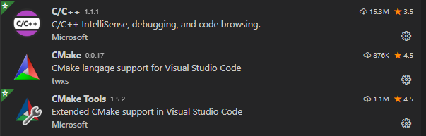

# cmake-demo-rom
Generates a ROM built with CMake
This uses the https://github.com/DragonMinded/libdragon/tree/trunk/examples/vtest (as of 2023-01-01) rom as a sample.

## Building
Although there have been improvements, the latest libdragon does not (yet) support CMake out the box.
All current steps below require at least one custom upstream component that may not always be inline with the latest available "official" improvements.

### Windows with VSCode
Requirements:
* Turning on Windows 10 or 11 developer mode Or Windows 7 with latest PowerShell version installed
* Enabling Remote Powershell execution policy (`Set-ExecutionPolicy Unrestricted`)
* a current version of [CMake](https://cmake.org/download/) (tested working with 3.18.4) to be installed (make sure the PATH variable is set).
* VSCode with `CMake`, `CMake Tools` and `C/C++` extensions

* Run `UpdateToolchain.ps1` to download the required toolchain and libdragon files
* Adjust CMakePresets.json for your paths if necessary (although should work automatically out the box)
* Adjust .vscode/settings.json for your paths (although should work automatically out the box)

Building the ROM:
In VS-Code
* Click on the Bottom bar to set the "Configure Preset": 
* Hit F7 to build the ROM

### Docker
See the current [docker workflow file](.github/workflows/build-docker.yml) for how you can do it.
By default, this build references the `trunk` branch. To change it, adjust the `ref: trunk` for the checkout.

## Launching ROM

### Windows with VSCode
Uses `launch.json` via `tasks.json` contained in the `.vscode` folder.
By default the applications are not installed and the paths will require updating.
